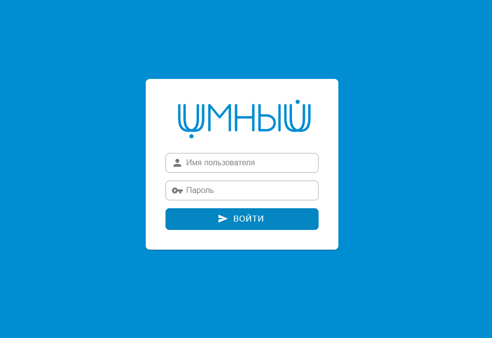
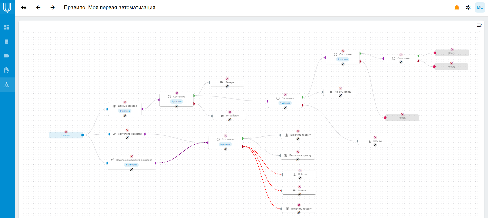

### Экосистема UMNI SERVER

**УМНЫЙ СЕРВЕР** - полноценная и активно развивающаяся экосистема, содержащая в себе:

- Администрирование и контроль устройств умного дома:
    - Устройства производства UMNI (например УМНЫЙ К1)
    - Датчики и сенсоры RF433, Zigbee (в разработке), Tuya (в разработке)
    - Возможность расширения системы устройств и сенсоров плагинами
- Видеорегистратор и видеоанализ: производите захват видеопотока с IP-камер, отслеживайте обнаружение движения
- Биометрию и распознавание, а также СКУД (систему контроля доступа) (в разработке)
- Гибкая система автоматизаций и уведомлений
- Полный контроль над данными - никаких облачных баз данных и передач данных третьим сторонам для обработки.

Проект такого масштаба - первый в России с открытым исходным кодом. Вы можете помочь с тестированием и улучшением,
принять участие в развитии проекта.

Система находится в разработке. Следите за обновлениями.

https://umni.su
https://docs.umni.su